# JSBSim Flight Dynamics Model Plugin - Extended Modules Documentation

## Table of Contents

1. [Overview](#overview)
2. [Architecture](#architecture)
3. [JSBSimUDPInput Module](#jsbsimudpinput-module)
4. [JSBSimSimulationFSM Module](#jsbsimsimulationfsm-module)
5. [Data Flow Diagrams](#data-flow-diagrams)
6. [Class Diagrams](#class-diagrams)
7. [Integration Guide](#integration-guide)
8. [API Reference](#api-reference)

---

## Overview

The JSBSim Flight Dynamics Model plugin has been extended with two new runtime modules:

- **JSBSimUDPInput**: Provides bidirectional UDP communication for receiving external control data and sending simulation state
- **JSBSimSimulationFSM**: Manages simulation lifecycle states with a finite state machine

Both modules integrate seamlessly with the existing `JSBSimFlightDynamicsModel` module and provide Blueprint-accessible interfaces.

---

## Architecture

### Module Structure

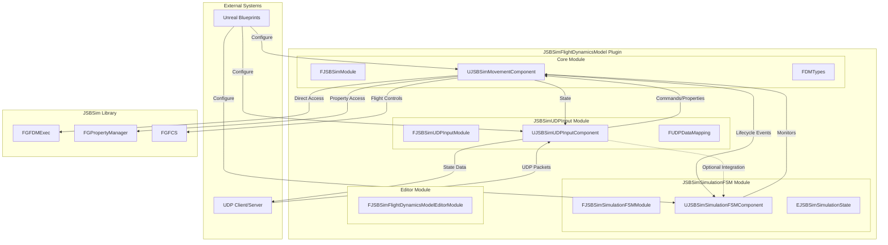

### Module Dependencies

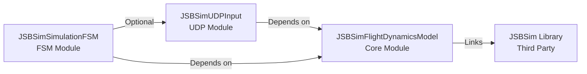

---

## JSBSimUDPInput Module

### Overview

The `JSBSimUDPInput` module provides bidirectional UDP communication capabilities, allowing external systems to send control commands to JSBSim and receive simulation state data.

### Key Features

- **Bidirectional Communication**: Receive control data and send state updates
- **Flexible Data Formats**: Support for JSON, Text (key-value), and Binary formats
- **Configurable Field Mappings**: Map UDP fields to JSBSim properties or command structures
- **Non-blocking Sockets**: Efficient polling-based receive/send
- **Blueprint Integration**: Fully accessible from Blueprints
- **Debug Visualization**: On-screen status display

### Component Architecture

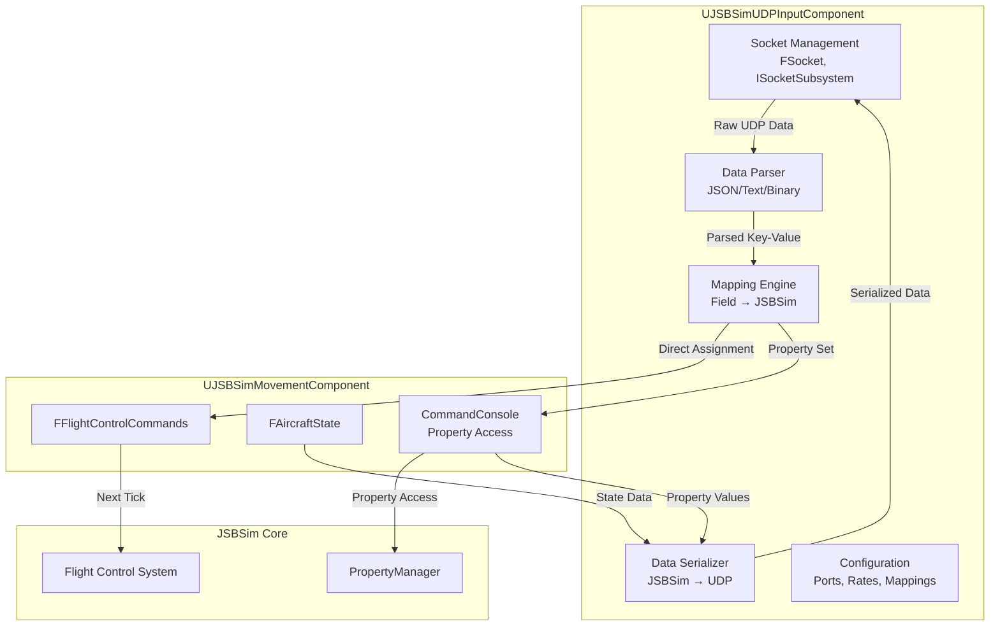

### Data Mapping System

The module uses a flexible mapping system to translate between UDP fields and JSBSim properties/commands:

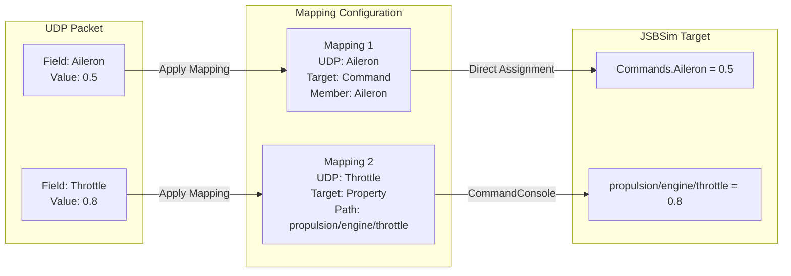

### Mapping Target Types

1. **Property**: Direct JSBSim property path (e.g., `propulsion/engine/throttle`)
2. **Command**: Flight control command structure member (e.g., `Aileron`, `Elevator`)
3. **Custom**: Extensible for custom use cases

---

## JSBSimSimulationFSM Module

### Overview

The `JSBSimSimulationFSM` module provides a finite state machine to track and manage the simulation lifecycle, monitoring the `JSBSimMovementComponent` and providing state transition events.

### State Machine

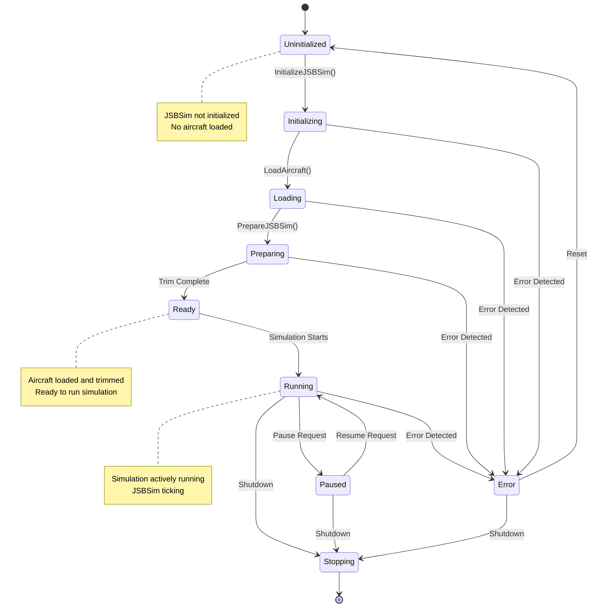

### State Monitoring

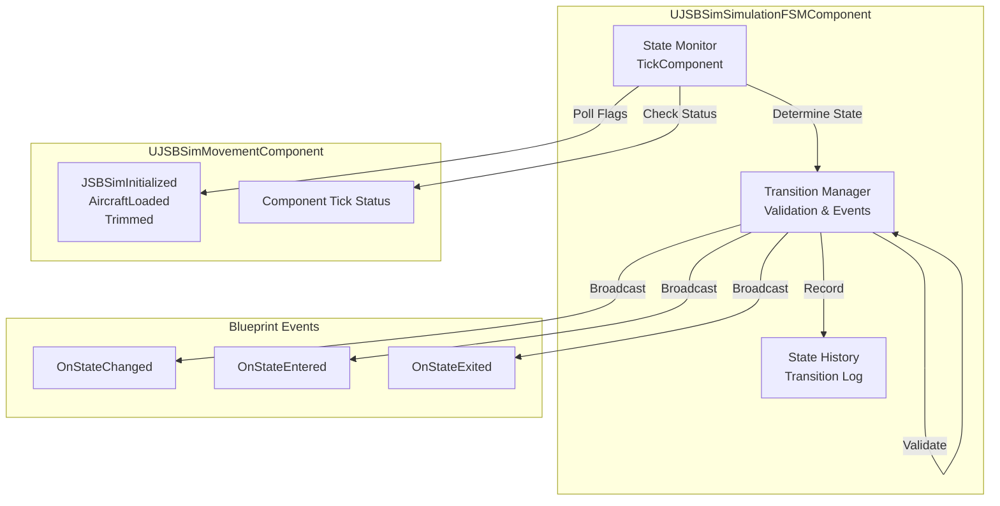

---

## Data Flow Diagrams

### UDP Input Flow (External → JSBSim)

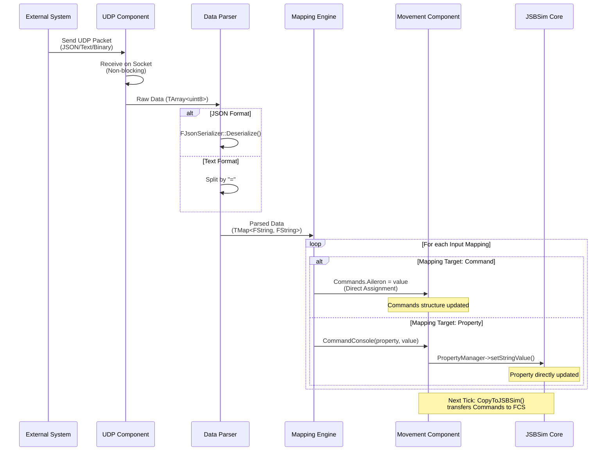

### UDP Output Flow (JSBSim → External)

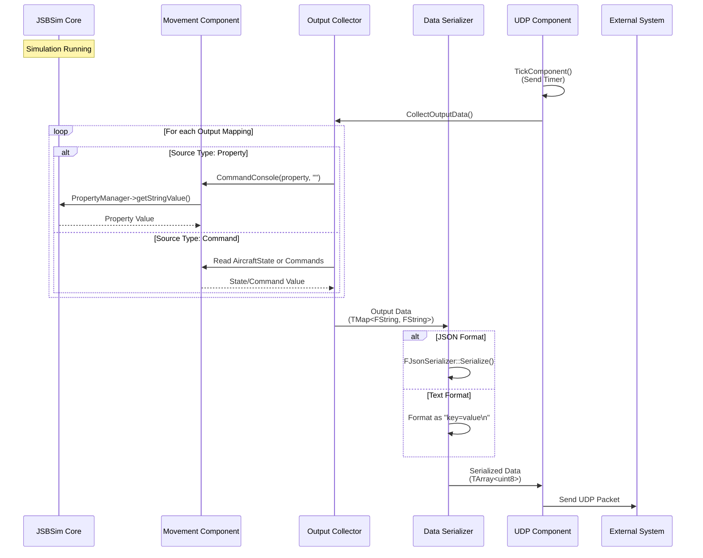

### FSM State Transition Flow

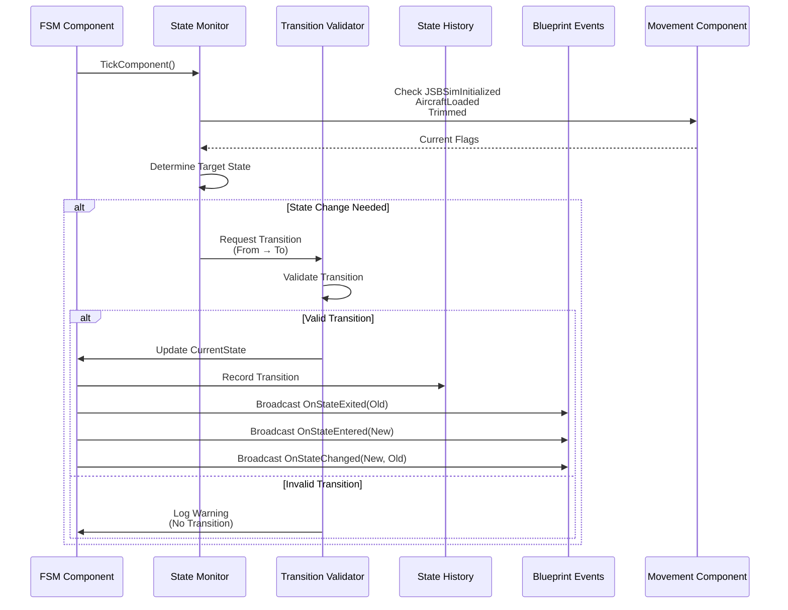

---

## Class Diagrams

### Module Class Hierarchy

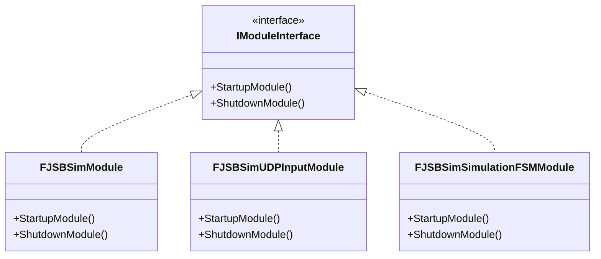

### Component Class Diagram

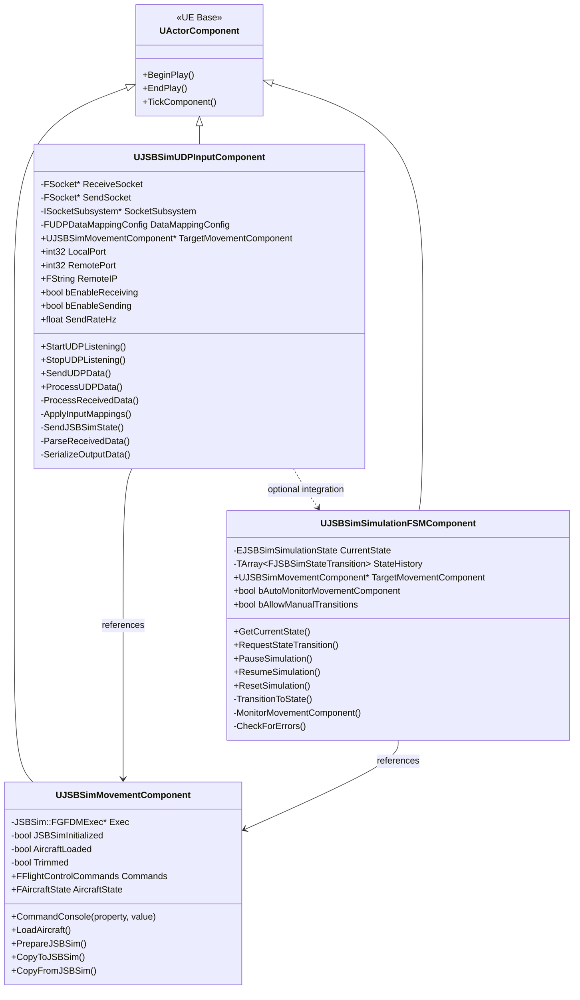

### Data Structure Class Diagram

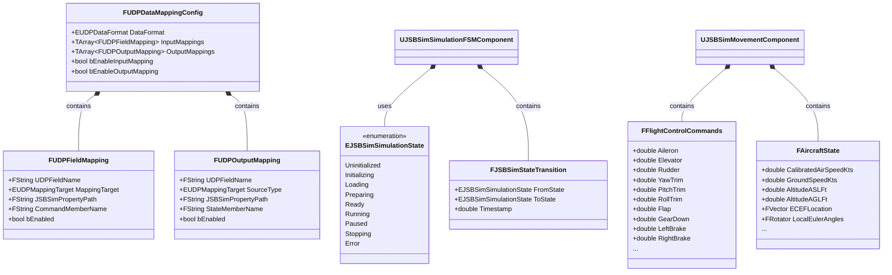

### Dependency Graph

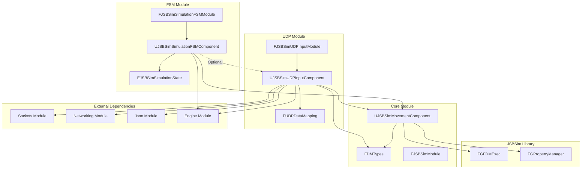

---

## Integration Guide

### Basic Setup

1. **Add Components to Actor**
   ```cpp
   // In your Actor class or Blueprint
   UJSBSimMovementComponent* MovementComponent;
   UJSBSimUDPInputComponent* UDPComponent;
   UJSBSimSimulationFSMComponent* FSMComponent;
   ```

2. **Configure UDP Component**
   ```cpp
   // Set target movement component
   UDPComponent->TargetMovementComponent = MovementComponent;
   
   // Configure ports
   UDPComponent->LocalPort = 8889;  // Receive port
   UDPComponent->RemotePort = 8890; // Send port
   UDPComponent->RemoteIP = TEXT("127.0.0.1");
   
   // Configure data format
   UDPComponent->DataMappingConfig.DataFormat = EUDPDataFormat::JSON;
   
   // Start listening
   UDPComponent->StartUDPListening();
   ```

3. **Configure FSM Component**
   ```cpp
   // Set target movement component
   FSMComponent->TargetMovementComponent = MovementComponent;
   
   // Enable auto-monitoring
   FSMComponent->bAutoMonitorMovementComponent = true;
   
   // Enable state transition logging
   FSMComponent->bLogStateTransitions = true;
   ```

### Configuring Data Mappings

#### Input Mapping Example (UDP → JSBSim)

```cpp
// Create input mapping for Aileron command
FUDPFieldMapping AileronMapping;
AileronMapping.UDPFieldName = TEXT("Aileron");
AileronMapping.MappingTarget = EUDPMappingTarget::Command;
AileronMapping.CommandMemberName = TEXT("Aileron");
AileronMapping.bEnabled = true;

// Create input mapping for direct property
FUDPFieldMapping ThrottleMapping;
ThrottleMapping.UDPFieldName = TEXT("Throttle");
ThrottleMapping.MappingTarget = EUDPMappingTarget::Property;
ThrottleMapping.JSBSimPropertyPath = TEXT("propulsion/engine/throttle");
ThrottleMapping.bEnabled = true;

// Add to configuration
UDPComponent->DataMappingConfig.InputMappings.Add(AileronMapping);
UDPComponent->DataMappingConfig.InputMappings.Add(ThrottleMapping);
```

#### Output Mapping Example (JSBSim → UDP)

```cpp
// Create output mapping for airspeed
FUDPOutputMapping AirspeedMapping;
AirspeedMapping.UDPFieldName = TEXT("AirspeedKts");
AirspeedMapping.SourceType = EUDPMappingTarget::Command;
AirspeedMapping.StateMemberName = TEXT("CalibratedAirSpeedKts");
AirspeedMapping.bEnabled = true;

// Create output mapping for direct property
FUDPOutputMapping AltitudeMapping;
AltitudeMapping.UDPFieldName = TEXT("AltitudeFt");
AltitudeMapping.SourceType = EUDPMappingTarget::Property;
AltitudeMapping.JSBSimPropertyPath = TEXT("position/altitude-ft");
AltitudeMapping.bEnabled = true;

// Add to configuration
UDPComponent->DataMappingConfig.OutputMappings.Add(AirspeedMapping);
UDPComponent->DataMappingConfig.OutputMappings.Add(AltitudeMapping);
```

### Blueprint Integration

Both components are fully Blueprint-accessible:

- **Properties**: All configuration properties are `BlueprintReadWrite`
- **Functions**: All public functions are `BlueprintCallable`
- **Events**: All delegates are `BlueprintAssignable`

### Event Handling

#### UDP Component Events

```cpp
// Bind to data received event
UDPComponent->OnUDPDataReceived.AddDynamic(this, &AMyActor::OnUDPDataReceived);

void AMyActor::OnUDPDataReceived(const TArray<uint8>& Data, const FString& SenderAddress)
{
    // Handle received data
}
```

#### FSM Component Events

```cpp
// Bind to state changed event
FSMComponent->OnStateChanged.AddDynamic(this, &AMyActor::OnSimulationStateChanged);

void AMyActor::OnSimulationStateChanged(EJSBSimSimulationState NewState, EJSBSimSimulationState PreviousState)
{
    // Handle state transition
    if (NewState == EJSBSimSimulationState::Running)
    {
        // Simulation started
    }
}
```

---

## API Reference

### UJSBSimUDPInputComponent

#### Configuration Properties

| Property | Type | Description |
|----------|------|-------------|
| `TargetMovementComponent` | `UJSBSimMovementComponent*` | Target JSBSim component to send data to |
| `LocalPort` | `int32` | Local port to receive UDP packets (default: 8889) |
| `RemotePort` | `int32` | Remote port to send UDP packets (default: 8890) |
| `RemoteIP` | `FString` | Remote IP address (empty = broadcast) |
| `bAutoStart` | `bool` | Automatically start listening on BeginPlay |
| `bEnableReceiving` | `bool` | Enable receiving UDP data |
| `bEnableSending` | `bool` | Enable sending UDP data |
| `SendRateHz` | `float` | Send rate in Hz (0 = every tick, default: 60) |
| `DataMappingConfig` | `FUDPDataMappingConfig` | Data mapping configuration |

#### Functions

- `bool StartUDPListening()` - Start UDP listening on configured port
- `void StopUDPListening()` - Stop UDP listening and cleanup sockets
- `bool SendUDPData(const TArray<uint8>& Data)` - Send raw UDP data
- `void ProcessUDPData(const TArray<uint8>& Data)` - Process received UDP data
- `void UpdateDataMappingConfig(const FUDPDataMappingConfig& NewConfig)` - Update mapping configuration
- `bool GetIsConnected() const` - Get current connection status

#### Events

- `FOnUDPDataReceived` - Fired when UDP data is received
- `FOnUDPDataSent` - Fired when UDP data is sent
- `FOnUDPConnectionStatusChanged` - Fired when connection status changes

### UJSBSimSimulationFSMComponent

#### Configuration Properties

| Property | Type | Description |
|----------|------|-------------|
| `TargetMovementComponent` | `UJSBSimMovementComponent*` | Target JSBSim component to monitor |
| `bAutoMonitorMovementComponent` | `bool` | Automatically monitor component lifecycle |
| `bAllowManualTransitions` | `bool` | Allow manual state transitions |
| `bLogStateTransitions` | `bool` | Enable logging of state transitions |
| `MaxHistorySize` | `int32` | Maximum state transition history size (default: 100) |

#### State Properties

| Property | Type | Description |
|----------|------|-------------|
| `CurrentState` | `EJSBSimSimulationState` | Current simulation state (read-only) |
| `StateHistory` | `TArray<FJSBSimStateTransition>` | State transition history (read-only) |

#### Functions

- `EJSBSimSimulationState GetCurrentState() const` - Get current state
- `bool RequestStateTransition(EJSBSimSimulationState NewState)` - Request state transition
- `bool PauseSimulation()` - Pause simulation (transition to Paused)
- `bool ResumeSimulation()` - Resume simulation (transition to Running)
- `bool ResetSimulation()` - Reset to Uninitialized state
- `void UpdateStateFromMovementComponent()` - Manually trigger state monitoring
- `FJSBSimStateTransition GetLastTransition() const` - Get last state transition
- `bool IsValidTransition(EJSBSimSimulationState From, EJSBSimSimulationState To) const` - Check if transition is valid

#### Events

- `FOnStateChanged` - Fired when state changes (provides new and previous state)
- `FOnStateEntered` - Fired when entering a specific state
- `FOnStateExited` - Fired when exiting a specific state

### EJSBSimSimulationState

Enumeration of simulation states:

- `Uninitialized` - JSBSim not initialized
- `Initializing` - JSBSim initialization in progress
- `Loading` - Aircraft model loading
- `Preparing` - Preparing simulation (trimming, etc.)
- `Ready` - Simulation ready to run
- `Running` - Simulation actively running
- `Paused` - Simulation paused
- `Stopping` - Simulation shutting down
- `Error` - Error state

---

## Example Usage Scenarios

### Scenario 1: External Flight Control System

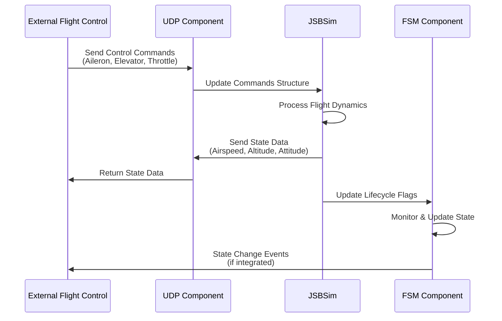

### Scenario 2: Simulation State Management

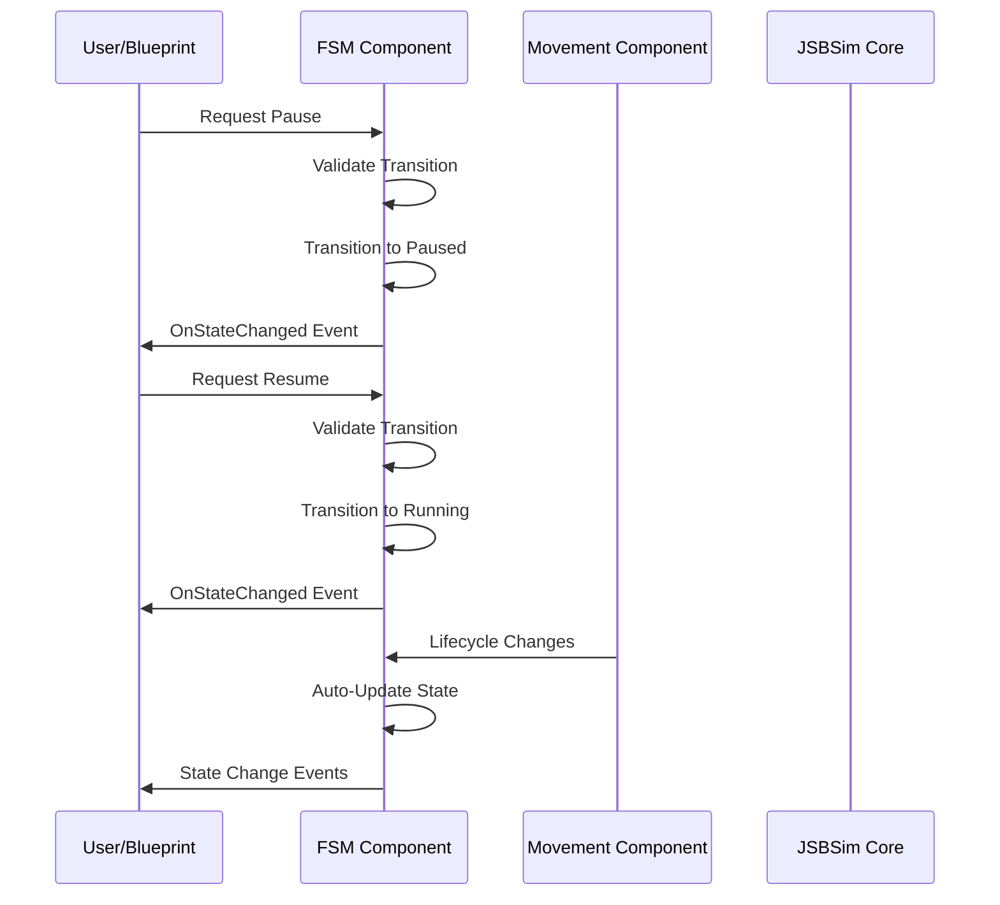

---

## Performance Considerations

### UDP Component

- **Non-blocking Sockets**: Uses non-blocking I/O to avoid blocking the game thread
- **Polling Frequency**: Receives data every tick (typically 60 Hz)
- **Send Rate Control**: Configurable send rate to limit bandwidth usage
- **Buffer Management**: Uses fixed-size receive buffer (4096 bytes)

### FSM Component

- **Polling-Based Monitoring**: Checks component state every tick
- **State History Limit**: Configurable history size to limit memory usage
- **Event Broadcasting**: Events are lightweight multicast delegates

### Recommendations

- Set appropriate send rates based on your needs (default 60 Hz is usually sufficient)
- Limit state history size if memory is a concern
- Use Blueprint events sparingly for performance-critical code
- Consider disabling debug visualization in production builds

---

## Troubleshooting

### UDP Component Issues

**Problem**: No data received
- Check that `StartUDPListening()` was called
- Verify `LocalPort` is not in use by another application
- Check firewall settings
- Enable debug visualization to see connection status

**Problem**: Data not reaching JSBSim
- Verify `TargetMovementComponent` is set
- Check that input mappings are configured correctly
- Ensure mappings are enabled (`bEnabled = true`)
- Check log output for parsing errors

**Problem**: Invalid data format
- Verify `DataFormat` matches the actual UDP packet format
- For JSON, ensure valid JSON syntax
- For Text, ensure "key=value" format with newlines

### FSM Component Issues

**Problem**: State not updating
- Verify `bAutoMonitorMovementComponent` is enabled
- Check that `TargetMovementComponent` is set
- Ensure component is ticking
- Check log output for state transition messages

**Problem**: Invalid state transitions
- Check `IsValidTransition()` to see allowed transitions
- Review state machine diagram for valid paths
- Enable `bLogStateTransitions` for debugging

---

## Future Enhancements

Potential improvements for future versions:

1. **Binary Protocol Support**: Full implementation of binary format parsing/serialization
2. **WebSocket Support**: Alternative to UDP for web-based interfaces
3. **State Machine Actions**: Execute actions on state transitions
4. **Advanced Error Recovery**: Automatic error recovery mechanisms
5. **Performance Metrics**: Built-in performance monitoring and statistics
6. **Configuration Presets**: Pre-configured mapping presets for common aircraft

---

## License

This documentation is part of the JSBSim Flight Dynamics Model plugin. See the main plugin LICENSE file for details.

---

## Version History

- **v1.01** - Initial release with UDP and FSM modules
  - Basic UDP bidirectional communication
  - JSON and Text format support
  - FSM with 9 states
  - Blueprint integration
  - Debug visualization

